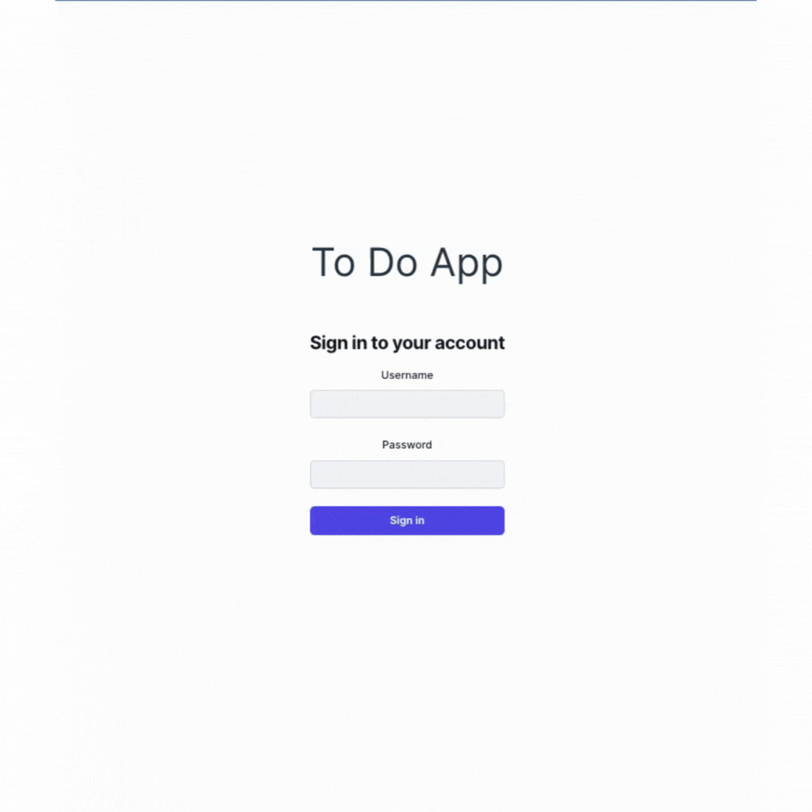
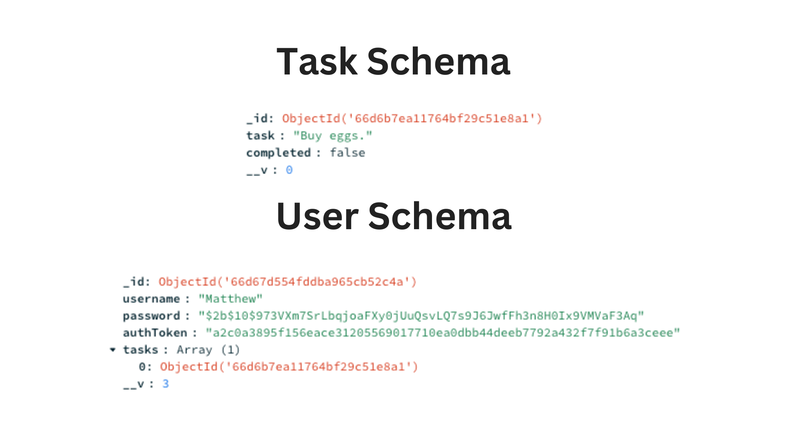

# todo-app

## Demo

## Tech Stack
Backend: Express.js, MongoDB / Mongoose
Frontend: React, TailwindCSS, DaisyUI
Testing: Postman and manual testing through frontend

## Database Models
- Created a user and task model, where users held an array of references to their associated tasks.
- The user model stored an encrypted password as well as a simple authToken for string authentication.

## Server API
- Implemented user creation, user login authentication (string check), and task creation and deletion for specific users.

## API Tests

## Frontend Work
- Utilized DaisyUI and TailwindCSS for quick implementation.
- Utilized hooks and effects to manage data transfer of authToken between login and task list page.
- Encountered a bug in one of my fetch requests for a user's task list, so the demo shows sample data instead.
- Included an add task and complete task button to add new tasks or delete tasks, though this is not connected to the backend yet.

## Plans on Persisting Data 
- Utilized React state to persist data in memory in both the login and task page for authentication and showing of current tasks, newly added tasks, etc.
- Planned to use JavaScript's localstorage API to persist data locally as long as the user was logged in. Through this, the user could add new tasks that would be stored locally, allowing them to exit the tab and reload it without losing their added tasks. However, if they choose to log out, these added and modified tasks would disappear as I planned to clear localstorage on log out. 
- Used MongoDB to hold tasks in a database record. I planned that when the user adds or modifies tasks and clicks the Save button, the new or modified tasks will be pushed to MongoDB through the backend server. These tasks will persist even after logging out and will present themselves upon login.